<p align="center">
  <h1 align="center">ChronoLock</h1>
  <p align="center">
  ChronoLock: Protecting Videos from Unauthorized Text-to-Video Personalization    <br>
    <a href="#overview">Overview</a> |
    <a href="#results-and-video-demo">Demo</a> |
    <a href="#installation">Installation</a> |
    <a href="#usage">Usage</a> |
    <a href="#acknowledgements">Acknowledgements</a>
  </p>
</p>

<p align="center">
  
  
  
</p>

## Overview

AntiMotion is a lightweight research codebase for generating protected videos before MotionDirector-style Temporal LoRA training. Given an input video and prompt, AntiMotion optimizes a bounded perturbation that targets temporal adaptation in text-to-video diffusion models while keeping the output in the original video format.

The current release includes:

- `ChronoLock/anti_motion.py`: two-stage PGD protection for a single `.mp4` video.
- `ChronoLock/model_loader.py`: Diffusers/Transformers model loading helpers.
- `ChronoLock/third_party/motiondirector/`: the minimal MotionDirector-compatible UNet and LoRA components required by the protection script.
- `ChronoLock/assets/results/`: reserved space for README demos, qualitative comparisons, and generated previews.
- `ChronoLock/data/`: original input videos used by the README demos.

## Method

AntiMotion uses a two-stage optimization process:

```text
Input video
  -> frame loading and resizing
  -> Stage 1: per-chunk PGD against Temporal LoRA adaptation
  -> Stage 2: cross-chunk PGD for temporal boundary disruption
  -> protected video
```

The objective combines a temporal denoising loss, an adversarial temporal difference branch, optional MetaCloak-style transform sampling, and a cross-chunk boundary term. The implementation is intentionally compact so experiments can be reproduced and modified directly from `ChronoLock/anti_motion.py`.

## Results and Video Demo

| Original video | Clean-training result | Protected-training result A | Protected-training result B |
| --- | --- | --- | --- |
| [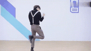](ChronoLock/data/ikun.mp4) | [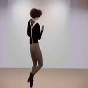](ChronoLock/assets/results/ikun/trained_on_clean.mp4) | [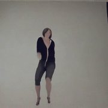](ChronoLock/assets/results/ikun/trained_on_protected_1.mp4) | [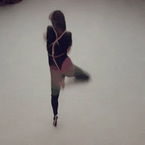](ChronoLock/assets/results/ikun/trained_on_protected_2.mp4) |
| [](ChronoLock/data/project_12.mp4) | [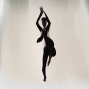](ChronoLock/assets/results/project_12/trained_on_clean.mp4) | [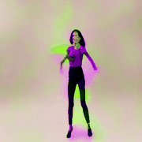](ChronoLock/assets/results/project_12/trained_on_protected_1.mp4) | [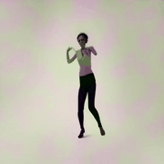](ChronoLock/assets/results/project_12/trained_on_protected_2.mp4) |
| [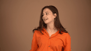](ChronoLock/data/project_13.mp4) | [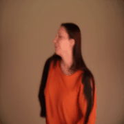](ChronoLock/assets/results/project_13/trained_on_clean.mp4) | [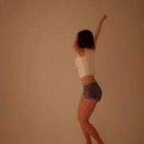](ChronoLock/assets/results/project_13/trained_on_protected_1.mp4) | [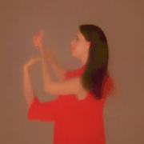](ChronoLock/assets/results/project_13/trained_on_protected_2.mp4) |

Clean-training results are generated by MotionDirector models trained on clean videos. Protected-training results are generated by MotionDirector models trained on AntiMotion-protected videos.

## Project Structure

```text
ChronoLock/
|-- README.md
`-- ChronoLock/
    |-- .gitignore
    |-- anti_motion.py
    |-- data/
    |   |-- ikun.mp4
    |   |-- project_12.mp4
    |   `-- project_13.mp4
    |-- model_loader.py
    |-- requirements.txt
    |-- LICENSE
    |-- assets/
    |   `-- results/
    |       |-- ikun/
    |       |-- project_12/
    |       `-- project_13/
    `-- third_party/
        `-- motiondirector/
            |-- models/
            |   |-- unet_3d_blocks.py
            |   `-- unet_3d_condition.py
            `-- utils/
                |-- convert_diffusers_to_original_ms_text_to_video.py
                |-- lora.py
                `-- lora_handler.py
```

## Installation

Create a clean Python environment. Python 3.10 or 3.11 is recommended.

```bash
cd AntiMotion

conda create -n antimotion python=3.11 -y
conda activate antimotion

pip install -U pip setuptools wheel
pip install -r requirements.txt
```

For CUDA environments, install the PyTorch build that matches your driver and CUDA runtime first, then install the remaining requirements:

```bash
pip install torch torchvision --index-url https://download.pytorch.org/whl/cu121
pip install -r requirements.txt
```

## Model Weights

Download a text-to-video base model separately. Model weights are intentionally not tracked in this repository.

```bash
hf download cerspense/zeroscope_v2_576w \
  --local-dir ./zeroscope_v2_576w
```

ModelScope T2V can also be used if the folder contains the expected Diffusers subfolders:

```bash
hf download ali-vilab/text-to-video-ms-1.7b \
  --local-dir ./modelscope_t2v_1.7b
```

Expected model layout:

```text
model_path/
|-- scheduler/
|-- tokenizer/
|-- text_encoder/
|-- vae/
`-- unet/
```

## Usage

The examples below use Linux shell syntax. On Windows PowerShell, set GPUs first with `$env:CUDA_VISIBLE_DEVICES="0,1"` and then run the `python anti_motion.py ...` command without the `CUDA_VISIBLE_DEVICES=0,1` prefix.

### Single Video

```bash
CUDA_VISIBLE_DEVICES=0,1 python anti_motion.py \
  --video_path /path/to/input.mp4 \
  --output_path outputs/protected_input.mp4 \
  --model_path ./zeroscope_v2_576w \
  --prompt "a person is moving" \
  --epsilon 0.05 \
  --pgd_steps 20 \
  --chunk_size 5 \
  --inner_steps 5 \
  --chaos_weight 0.2 \
  --global_weight 0.5
```

The output path should be a single `.mp4` file.

## Main Arguments

| Argument | Default | Description |
| --- | --- | --- |
| `--video_path` | required | Input `.mp4` file. |
| `--output_path` | `protected.mp4` | Output `.mp4` file. |
| `--model_path` | required | Local path to the base text-to-video model. |
| `--prompt` | `a person is moving` | Text prompt used by the protection objective. |
| `--width` | `576` | Width used when loading and resizing frames. |
| `--height` | `320` | Height used when loading and resizing frames. |
| `--epsilon` | `0.05` | Perturbation budget in `[0, 1]` pixel space. |
| `--pgd_steps` | `100` | Number of per-chunk PGD steps. |
| `--step_size` | auto | PGD step size. Defaults to `2.5 * epsilon / pgd_steps` after scaling. |
| `--chunk_size` | `5` | Number of frames per temporal chunk. |
| `--inner_steps` | `1` | Inner Temporal LoRA update steps. |
| `--inner_lr` | `1e-4` | Learning rate for inner LoRA updates. |
| `--surrogate_interval` | `10` | Steps between surrogate LoRA updates. |
| `--surrogate_lr` | `1e-5` | Learning rate for surrogate updates. |
| `--lora_rank` | `16` | Temporal LoRA rank. |
| `--chaos_weight` | `0.15` | Weight for intra-chunk temporal discontinuity. |
| `--global_weight` | `0.1` | Weight for cross-chunk boundary disruption. |
| `--global_pgd_steps` | `20` | Additional cross-chunk PGD steps. Set to `0` to disable Stage 2. |
| `--transform_sample_num` | `1` | Number of transform samples when transform sampling is enabled. |
| `--no_transform` | disabled | Disable transform sampling. |

## Hardware Notes

CUDA is strongly recommended. If multiple GPUs are visible, the script places the VAE on `cuda:1` and the UNet/text encoder on the main CUDA device to reduce memory pressure. CPU execution is available through PyTorch fallback but is not practical for normal experiments.

## Outputs

For each processed video, AntiMotion writes:

- A protected `.mp4` video.
- A terminal perturbation report containing epsilon, average L2 per frame, and PSNR.

Generated videos, base model weights, checkpoints, and experiment logs should stay outside git unless they are small README demo assets.

## Acknowledgements

This repository includes minimal MotionDirector-compatible components under `ChronoLock/third_party/motiondirector/`. Please follow the upstream licenses for MotionDirector, Diffusers, Transformers, ModelScope, and any base model weights used in your experiments.

## License

This project is released under the Apache-2.0 license. See [LICENSE](ChronoLock/LICENSE) for details.
